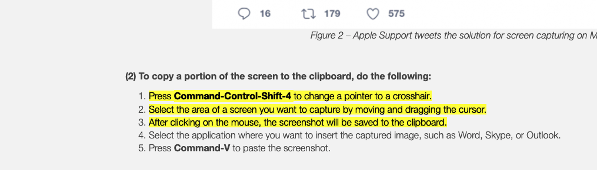

# Tags and Tag Explorer

## Tags

You can add tags to your notes to categorize them, or in any way you want.

There are two ways to add tags:
- you can add #tags just by writing them in the note
- another way is through [[note-properties]], as you can see at the top of this file

## Tag Explorer
In the sidebar to the left, you will see a panel called `Tag Explorer`.

You can use this panel to see the tags in your notes, and navigate them.

Notice `my-tag1` and `my-tag2`, which were added via [[note-properties]].

[//begin]: # "Autogenerated link references for markdown compatibility"
[note-properties]: note-properties.md "Note Properties"
[//end]: # "Autogenerated link references"

#another-tag

But what the heck does this tag even get saved. Okay it only gets updated when you save the file.

#minju-pretty
  

    

