# What Counts as Keto

## Foods that have low Card impact
Oils/Fats
1. Butter/Olive oils
2. Cream
3. Avocado

Proteins
1. Meats
2. Fish
3. Eggs
4. Cheese
5. Yogurt

Carbs
1. Lettuce
2. Tomatoes
3. Eggplants
4. Cucumbers/Zuchini
5. Brocolli
6. Cauliflower
7. Bellpeppers

## Foods with Medium Carb Impact
Fruits
1. Bananas
2. Strawberries
3. Mangos
4. Potatoes (15) not as bad as I thought

Carbs
1. Rice (28)
2. Pasta (29)
3. Bread (46)
4. Donuts (49)

Sugary Stuff
1. Soda/Juice (52)
2. Chocolate Bar (60)
3. Candy (70)

Ratings are net carbs/100g

## Drinks

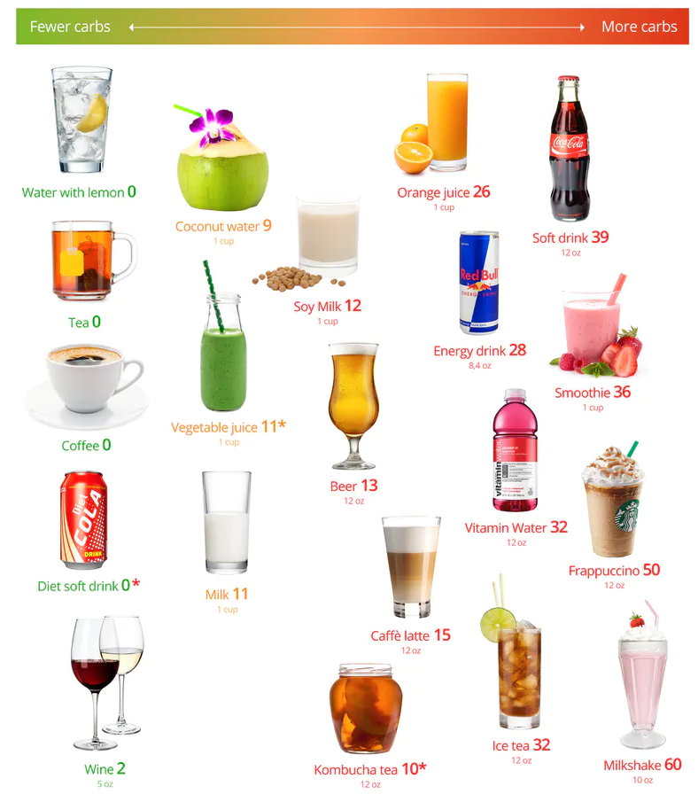

## Vegetables

### Above Ground
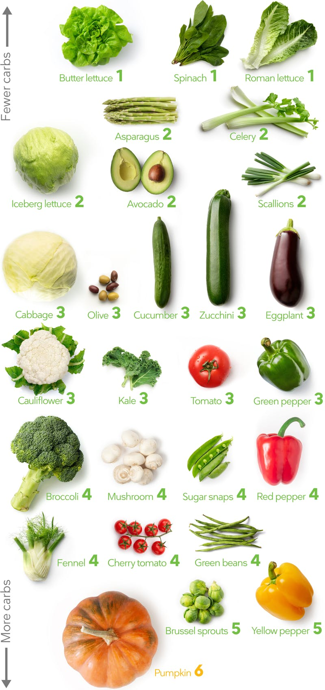

### Below Ground
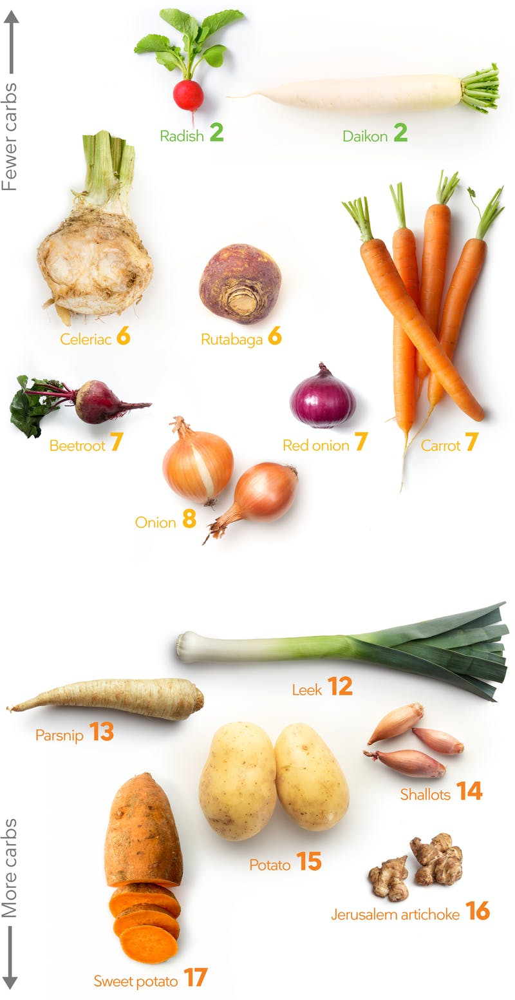

Eat raw veggies with Cream cheese/Mayonnaise/Peanut Butter
1. Carrots
2. Cucumbers
3. Peppers

### Legumes/Peas
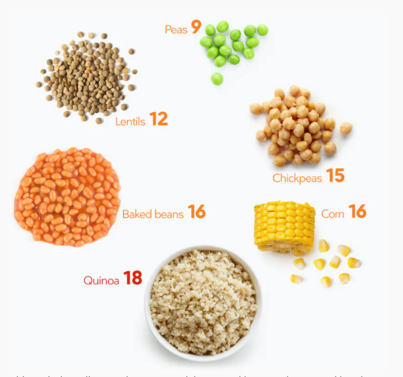

### Grains/Sugar
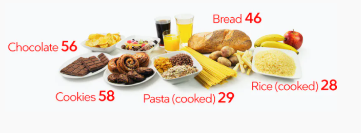

## Fruits

### Berries
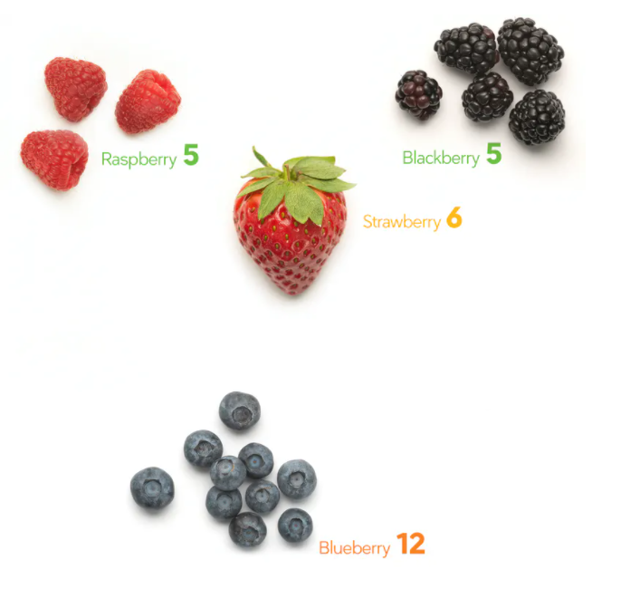

So my darker berries is not bad. It's pretty good as a smoothie drink

### Others Fruits

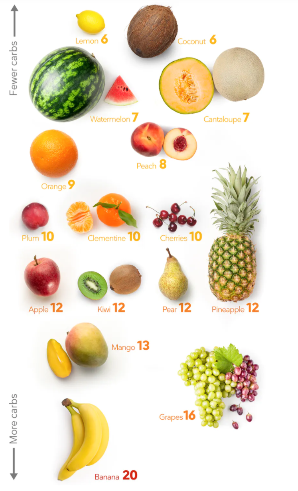

So yea having Mango and Bananas are kinda iffy. The frozen mangos I have arent as sweet though.

### Nuts

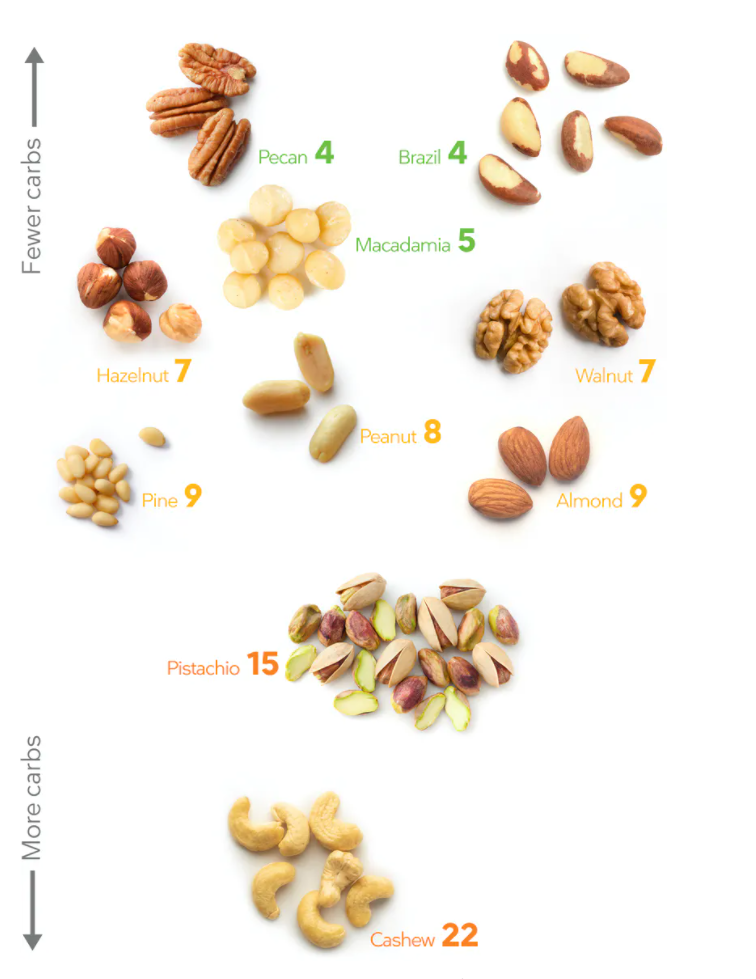

Eat nuts if you feel hungry not as snacks. You most likely will burn the fat of the nuts rather than your body's fat if you eat too much. Especially salted varieties can be more addicting.

1. Select how much you want to eat
2. Place into small bowl
3. Avoid mindlessly munching on nuts or doing other activities that take most of your attension
4. Cut back if fat loss is stalling

### Chocolate

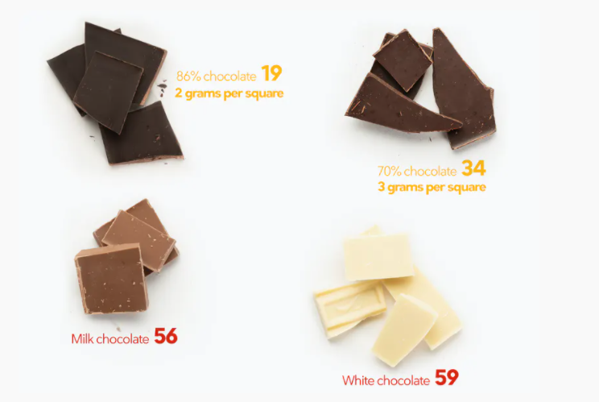

So one sq of chocolate (86%) is around 2g of net carbs. Shaving one over whipped cream sounds so good.

## Dairy

Avoid Milk, Buttermilk, Sweetened or fruit flavored yogurt, Low Fat Yogurt.

## Sauces

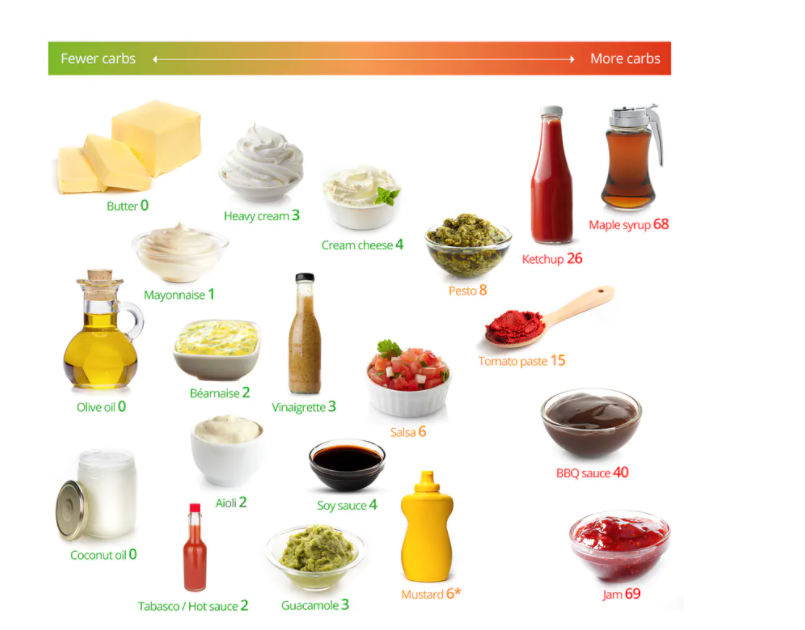

Got to be careful of Ketchup, Tomato paste and BBQ sauce.

Soy sauce is okay so can use it for eggs. Also read labels to check for sugar amounts.

## Avoid at all cost High Sugar Content

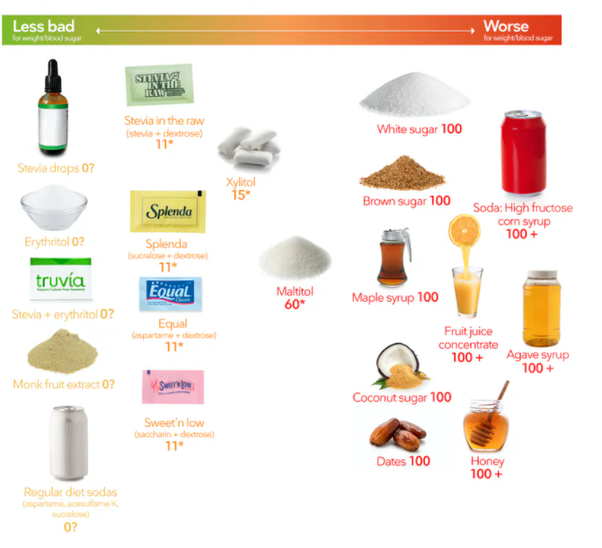

Avoid all sugars, honey, malitol, fructose and all that sort. Really bad for your health.

Also go easy on sweeteners. It's very easy to adapt to the sweetness. Natural foods don't taste as good or such. The issue could also be that eating sweet tasting foods/drinks promote a craving for sweet tasting food. Usually those cravings lead to eating sugary food without sweeteners or a preference towards sweet foods.

## End goal

My goal is to have <= 100 g of Carb a day. This means that
1 medium banana ~ 24g carbs already
1 large apple ~ 25g carbs

Eating 2 larger meals (breakfast & lunch) is more effective than 6 smaller meals in a reduced energy regimen for patients with type 2 diabetes. Maybe because you're intaking less calories overall

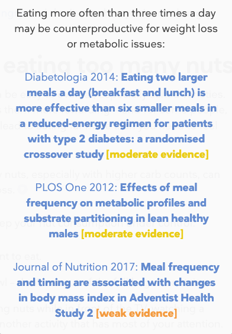

That's the things with snacks. You start eating mindlessly. I also notice when I watch TV or shows while eating, I tend to eat much more food than normal.

What if I made it so that if I eat food or eat snacks, I don't watch shows or TV with it. If that's the case then I won't eat lunch while eating food nor dinner in my computer room.
I might even enjoy the taste of food even more too.

## Interesting

OMAD - Eating OMAD might not provide
1. Sufficient Caloric Intake
2. Sufficient Protein Intake

Another thing to note is you can try alternative day fasting
M: 2 meals with 16:8 1800 calories
T: OMAD 1200 claories
W: 2 meals 16:8
Th: OMAD
F: 2 meals 16:8
S: Anything depending on Social schedule
S: OMAD

One thing for me is that eating food tends to make me sleepy or less focused. Even eating high fat and low carbs food still makes me less focused. I seem to focus much better in a fasted state.

I havent had any luck following the 4 hours (4pm - 8pm) eating window. Mainly because I nap to 4:32pm then go exercise. So actually I start eating around 6pm? Not that much time before my next meal for dinner.

One thing however, I noticed that with OMAD is I tend to restrict on snacks at night. When I make sure not to eat 2hrs before bed, I stop snacking. I can't basically due to the schedule.

I think no matter which eating windows or lifestyle choice I make, the most important is being consistent. Consistency is the key to building good life-long habits. Such as with practicing leads to improved neuroplasticity so that repeated actions or routines become second nature and natural.

## Like what AthleanX talks about

( F + C + G ) / 2/3

Basically you can only pick either the two or somewhat between.
You can have
1. Fast and Cheap - Usually unhealthy food. Bad!
2. Cheap and Good - Requires time commitment to cooking. Good.
3. Good and Fast - Requires financial commitment to buying meal-prep or catered services.

How about just going intermittent fasting or OMAD. Or simply go Liberal (<100g of net carbs) to reduce hunger or cravings and eat less food overall.

## Insulin & Insulin Resistance

Insulin promotes the body to store glucose as fat. Insulin and insulin resistance is linked with type 2 diabetes and severe insulin resistance.

胰岛素 - insulin (yi dao fu)

Both processed food and sugar stimulates insulin. They drive up blood sugar which in turn stimulates insulin. Stores away excess sugar. You get hungry because you can't access it so you eat more.

Another things is that sugar and process food has no macronutrients. They provide alot of energy but not enough micronutrients so body feels or feels its lacking.