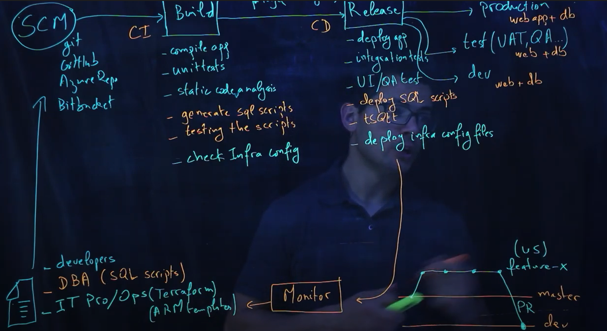

# Thursday, February 4, 2021

## CI/CD

Continuous Integration (CI)
: automated process where scripts are run when the code committed to the branch

This is the **Build** process where scripts such as for:

### Dev Pipeline
* Compile App
* unit tests
* static code analysis

### Database Analyst (DBA)
* generate SQL scripts
* testing scripts

### IT Pro/Ops (Terraform/Arm templates)
* Check infrastructure configs

Continuous Deployment
: automated process where scripts are run when the code is released for Deployment

This is the **Release** process for scripts to be run for:

### Dev Pipeline
* Deploy App
* Integration tests
* UI/QA tests

### Database Analyst (DBA)
* deploy SQL scripts
* tSQLt

### IT Pro/Ops (Terraform/Arm templates)
* Deploy infrastructure configs

[Link to Video](https://www.youtube.com/watch?v=XusC2o-Y_fU)
[Bitbucket Presentation (10:35)](https://www.youtube.com/watch?v=ibiusir3jaM&t=629s)
[Fireship 100sec (toWatch)](https://www.youtube.com/watch?v=scEDHsr3APg)

#ci-cd #dev-ops #programming

## KeyboardAvoidingView

A view where it shifts up the content depending on the keyboard. So the keyboard doesn't hide it.
#programming-tips #react-native