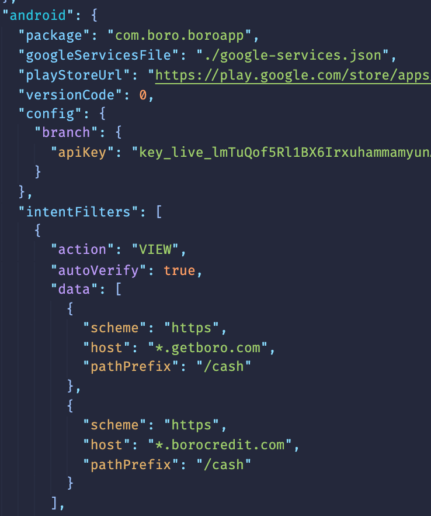
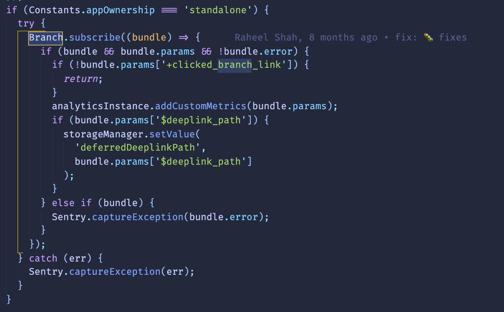

# Monday, February 15, 2021

## Methods to improve conditional readability
[Medium Article](https://medium.com/javascript-in-plain-english/6-tips-to-improve-your-conditional-statements-for-better-readability-56256c5a5245)

### Array.includes

```javascript
const isPet = (animal) => {
  const petList = ['cat', 'dog', 'giraffe', 'monkey'];
  return petList.includes(animal) // Returns 'true' if exist || 'false' if not
}
```

### Default Function Params

Personally I don't like having nulls or undefined. They always throws errors so I do believe it is better to instantiate your function parameters with a default value.

```javascript
const isBabyPet = (pet, age=1) => {
  if (age < 1) {
    return true;
  }
  return false;
}
```

### Array.every

```javascript
const pets = [
  { name: ‘cat’,   nLegs: 4 },
  { name: ‘snake’, nLegs: 0 },
  { name: ‘dog’,   nLegs: 4 },
  { name: ‘bird’,  nLegs: 2 }
];
const check = (pets) => {
  for (let i = 0; i < pets.length; i++) {
    if (pets[i].nLegs != 4) {
      return false;
    }
  }
  return true;
}
check(pets); // false
```

Otherwise, you can use `every()`

```javascript
let areAllFourLegs = pets.every((petItem) => petItem.nLegs === 4);
```

Reminder that I need to view or take a look over all the different array methods and string methods.

[9 Hard Lessons](https://medium.com/better-programming/9-hard-lessons-i-struggled-to-learn-during-my-18-years-as-a-software-developer-14f28512f647)

## Branch - Linking SDK

Branch does 2 things:

1. Manages universal linking (iOS) and applinking(android) to improve user experience (No more broken links)
2. Track attributions of app installs or downloads up to 7 days after ad campaigns or banner clicks.

* Basically it allows you to configure how you want the linking to work for android/ios experience. You can direct users to the app store if they don't have the app or to specific screens using universal linking or deep linking.
* Manage and see all the branch statistics and configuration on `dashboard.branch.io`
* Ads - ad platforms and partner management: if partner management is on branch then you can configure and setup a link there, Otherwise
* Quick Links - branch links with metadeta embedded (Disallowed on Facebook)
* Journeys - Banner pop up to install app

### App.json

#### iOS Configs
  

#### Android Configs
  

Basically the configs states what types of universal linking and app linking do you want for your app.

### Setting up Branch for app
  

Just import your `Branch` package, subscribe to it and start using it.
