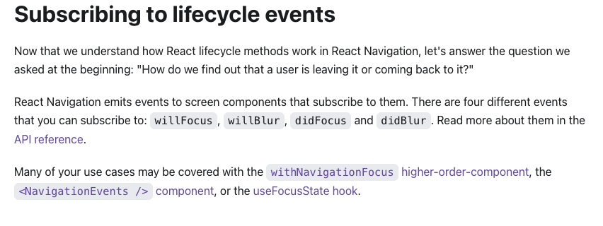

# Saturday, February 20, 2021

## Going through Clickup Planning

1. Remove the Work Hours Space
   1. Temptation Bundling - Complete dreary tasks by combining them with stuff you enjoy
      1. ex. Calling Telus support while watching running man or anime
   2. Batching - Combine similar tasks together in a time slot
   3. Parkinson's Law - Reduce the available time to complete a task to finish faster
      1. However, not with unrealistic deadlines. Having unrealistic deadlines makes it more stressful and less likely you want to follow through with it
   4. 

 ## react-router-flux

[Navigation life cycle methods](https://reactnavigation.org/docs/4.x/navigation-lifecycle)

1. Interesting to see how componentDidMount() or componentWillUnmount is dealt here
2. if stack: A, then .push(B) will call B componentDidMount() but A's componentWillUnmount() will not because A is still mounted. Only if A is popped out the stack then componentWillUnmount() will be called
3. so there's other methods to use to see if an user is returning to a screen or not

1. `Navigate()` checks to see if the page exists.
   1. However, `Navigate()` will pop all the top most screens in the stack until the selected top most route
   2. We don't want to remove all these screens
2. `Push()` will push the screen regardless if it exists already
   1. `Push` and `Pop` simulates what we want

