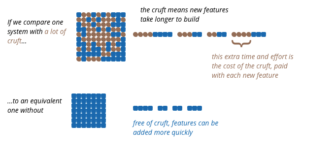

# Thursday, March 4, 2021

## React Higher Order Components

[react hoc](https://capgemini.github.io/frontend/react-HoCs/)

A component that accepts a component and returns another component.

```javascript
const withLoader = (WrappedComponent) => {
  const DataFetcherLoadingWrapper = (props) => {
    const { data: { loading } } = props;
    return (
      if (loading) {
        return <Loading />
      }
      return <WrappedComponent {...props} />
    );
  };
  return DataFetchedLoadingWrapper;
}
```
[react hoc docs](https://reactjs.org/docs/higher-order-components.html)


## Software Architecture matters

[Martin Fowler Article](https://martinfowler.com/architecture/)

Architecture is
1. Shared understanding that the expert developers have of the system design
2. Decisions you wish you could get right early in a project
3. "about the important stuff. Whatever that is"

### [Why is software architecture important?](https://martinfowler.com/articles/is-quality-worth-cost.html)
* Hard to perceive for end users and customers
* Poor architecture contributes the growth of cruft, elements of software that impedes developers to understand the software
* Leads to software features to be harder to modify, slower to release and with more bugs




In the short term, it seems like you can sacrifice quality for faster delivery in the short term but long term wise it has an impact. Experienced developers reckon that **attention to internal quality pays off in weeks not months.**

There's so many good articles and blog articles on this. I think it's beneficial to read them and try to understand it. I think it's important to have a deeper understanding on this before pitching so you have confidence on what you know and how to progress or move along. In fact, I might just mention this fact that working on the code is hard. 

We might not need documentation or very detailed or descriptive documentation. We can use our tests to be our documentation.

In the end, businesses care about making money and reducing costs. Having good architecture or code standards make it so that
1. Features can be pushed out quicker with less bugs
2. Developers don't have to spend as much time debugging or trying to understand code
3. Refactoring or changing code becomes significantly easier to implement

Overall **More features, Less Bugs, Less Development Time**

Nice looking BMW. It looks nice, it's shiny, it's nice. But once you start driving you start getting engine problems, it stutters, oil leaks or stuff just starts breaking down. We want the car to build well enough that we can modify it (new seat warmers, add a turbo to your enginer Increase HP) quickly and easily. If the car is well designed this would be easy or simple enough, look at the manual or if there's no manual, the car is constructed and designed in a logical way.

However the issue comes when the car isn't built in a logical way. The parts haven't been through rigorous QA and are breaking down. The engine has been just pieced together to get it working, adding more and more parts but maintenance and bug fixing it is increasing harder to do.

That is how we should view Code architecture. We want to build a strong and stable house not a haphazard one. To do that, we need verify that the parts are strong. We need to make sure we have a good foundation (blueprint) and modular in a way where we can add new features (new stove, washing machine or etc.)

## Making decisions
[How to make smart decisions](https://www.inc.com/jeff-haden/amazon-founder-jeff-bezos-this-is-how-successful-people-make-such-smart-decisions.html)

I agree with the article. There are two types of decisions: 

### Type 1 decisions
One-way doors. Irreversible or nearly reversible decisions such as quitting your job, selling your company or marrying your spouse.

### Type 2 decisions
Two-way doors. These decisions are reversible and you can just go back through the door when you made a bad type 2 decision. These include starting a side-hustle, offering a new service, implementing new architecture changes or new pricing schemes.

Although type 2 decision may seem momentous, with time and effort(often less than you think), they can be reversed.

> As organizations get larger, there seems to be a tendency to use the heavyweight Type 1 decision-making process on most decisions, including many Type 2 decisions. The end result of this is slowness, unthoughtful risk aversion, failure to experiment sufficiently, and consequently diminished invention. We'll have to figure out how to fight that tendency.


I also agree with the article that failures are coupled with invention. If you want to innovate you need to embrace failures. Not everything you do will succeed. However, to contrast between Google's and Amazon's experimentation mindset, is to carefully consider whether the experiment is a failure or allowing enough time for it to reveal the result.

ex. Stadia - Google's already closing down the studio. Why? It could work and succeed later on. [killed by google](https://killedbygoogle.com/)

Amazon has its string of unsuccessful business ventures such as the Firephone. However if you don't evaluate carefully and just crush it, then it'll be a type 1 decision. You might just revive again if it's popular but at that point why would people use it again after you shut it down.

>... failure and invention are inseparable twins. To invent you have to experiment, and if you know in advance that it's going to work, it's not an experiment. Most large organizations embrace the idea of invention, but are not willing to suffer the string of failed experiments necessary to get there. Jeff bezos