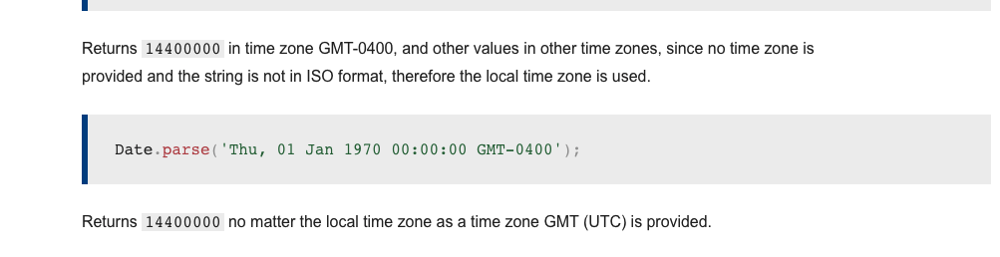

# Tuesday, March 23, 2021

[Ruby:When working with APIs](https://thoughtbot.com/blog/its-about-time-zones#working-with-apis:~:text=Working%20with%20APIs,-When)

As stated, it's best to use the `ISO8601` standard to represent date/time information as a string.

[Mozilla JS Date](https://developer.mozilla.org/en-US/docs/Web/JavaScript/Reference/Global_Objects/Date/parse)

Javascript's `Date` object doesn't accept `Ruby` local time date string.

It seems whats happening with `Date.parse(time)` is that the format is incorrect. I think we should stick to a standard `ISO8601` time rather than following Ruby's date string with timezone.

### Maintenance Fee of Code

Never really thought of it that way. There's a cost to modifying it, fixing it, upgrading it, refactoring it or repurposing code.

Take your time in development instead of rushing it all out.

[A good article on Saying No](https://levelup.gitconnected.com/an-engineers-guide-to-saying-no-3b2dba385c66)

#saying-no #programming-tips