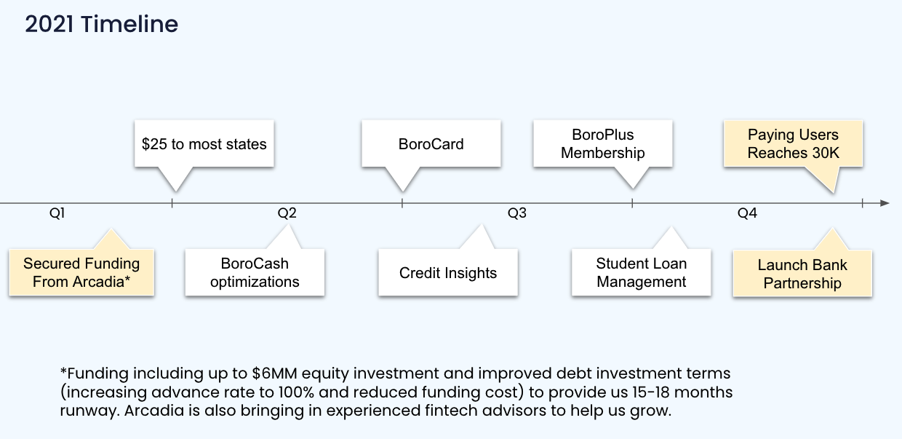

# Tuesday, March 30, 2021

## Questions to Ask

1. How would that GraphQL server handle sending different request to the Ruby code or Node part? Oh are you forwarding the request to that specific API end point?
2. What is FB & Firebase SDK for app?
3. What's going to happen with the AllCashOrders screen? Isn't there supposed to be some modifications to it to be done?
4. Ask about using library `@testing-library/react-native` because `react-native-testing-library` is deprecated.

## Questions for 1-on-1
1. What is the 1 year product roadmap for the team will be?

2. What is your vision for me on this team? What do you want me to do?

### Progress Update
1. Unit/Integration Testing
   1. I don't know what to test at the moment.
   2. Dont't know what's important and what's not. Important to test behavior > implmentation
   3. Comes from the experience of adding tests
2. E2E Testing
   1. [Detox](https://github.com/wix/Detox) - Graybox E2E automation library for mobile apps on simulator
   2. We still need manual QA but saves time and

## Production Logs on Ruby Server
1. Disk space - Not sure how that log was generated. Is it nginx command that goes to this location
   1. LK: Nginx Command - Main Nginx config file. OPT nginx
2. Problem - Creating logs too fast
   1. Should automatically clean the logs after a couple days/weeks
   2. On prod server. Have 500gb disk

## Meeting with Siyun

1. Questions about BE and FE
   1. Ruby- Easier to work and testing once you learn it
      1. Issue is with scalability
      2. Can't handle so many concurrent requests.
      3. Talent pool for Rails developer is smaller
   2. Node - Async/await makes it very good at scheduling requests
      1. Can handle a lot of requests at the same time
      2. Issue is that Node isn't good at processing large computationally expensive request/tasks
      3. However, send it to another microservice such as Python/Go/Rust/Java to handle
2. Currently AWS cloud costs around $4k/month (~48k/year)
   1. However it's cheaper relative to developer salaries to create inbuilt solutions
   2. AWS is the market leader
      1. Might be more expensive however,
      2. Talent acquisition is better; More knows AWS/talent pool larger
      3. Siyun worked with Alicloud - High maintenance costs although cheaper to operate
3. My role in all of this
   1. Siyun is looking for leaders for the company growth
   2. Considered me or kept me because of this
   3. Told him my current interest is on the front end side but I want to learn full-stack component
4. Offered me a base salary of 79k + 2k bonus
   1. Stock options ~3 months later
5. Told him about my plans for the product mainly with testing
   1. Unit/Integration testing on the FE
   2. Detox for E2E testing
6. Start to focus on gamification
   1. Retain users and have users stay on the app
   2. Need to consider the morality of this
   3. Have people glued to the app or so on forth
   4. How should I as a Christian view this way? Aren't you trying to make people addicted?
7. Microservices vs Monoliths
   1. Microservices - issue is too many microservices and can't keep track
   2. Monoliths - huge messy codebase of spaghetti code
8. Future roadmap
   1. Until July, focus will be on
      1. Integration of Galileo - Middleman card API & Dosh - Cashback rewards
      2. Setting up server to hande graphql request to route to microservices. Currently the node services require the Rails server to handle requests
      3. Looking to deprecate the Rails BE so going forward slowly with microservices is the best options
   2. The rest of the year is focused will be on optimizations UX for gamification and launching Boro card
9.  There will be a new company name
10. Company mission: building students a better financial future
    1.  Want to start building an early consumer base
    2.  Financial products for students include:
        1.  budgeting
        2.  loans
        3.  building credit
11. Need to find a viral product
12. Lexin wanted to acquire Boro's lending certs. Arcadia wanted the company instead
    1.  Lexin was planning on pushing a POS system for shopping malls like they did in China
13. Siyun graduated from Berkley
    1.  Worked for the other company that paid for everything in Atlanta: Housing/Food/Car
    2.  I can tell from our convos, he's such a smart guy
14. Asked him about his honest opinion on the company
    1. Other companies would've offered 2x salary + stocks
    2. A lot of potential but difficult like any startup. Need to find that viral product

[MMKV github](https://github.com/Tencent/MMKV#:~:text=MMKV%20is%20an%20efficient%2C%20small,%2FmacOS%2C%20Win32%20and%20POSIX)