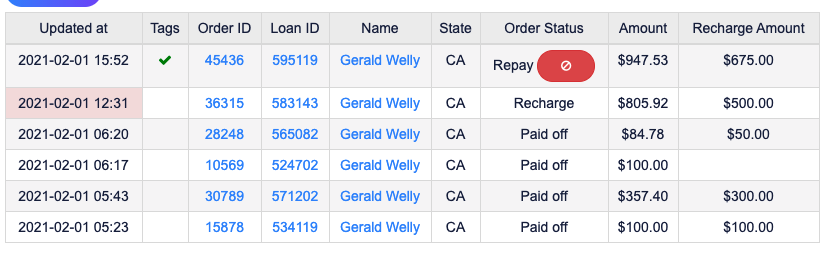
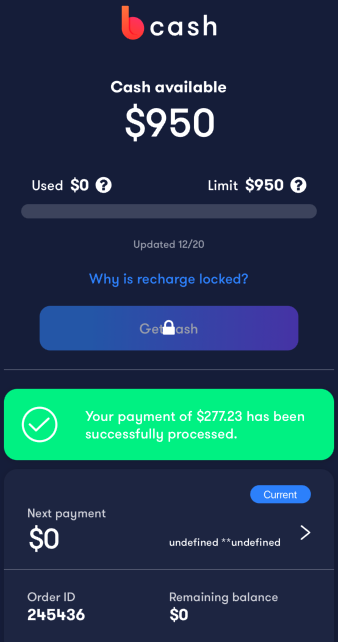
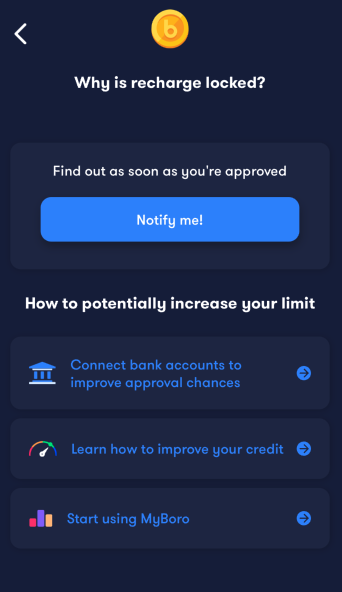
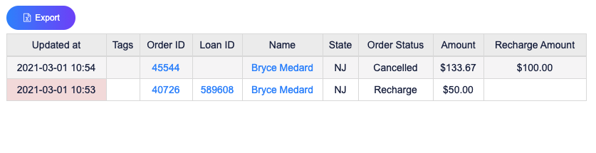
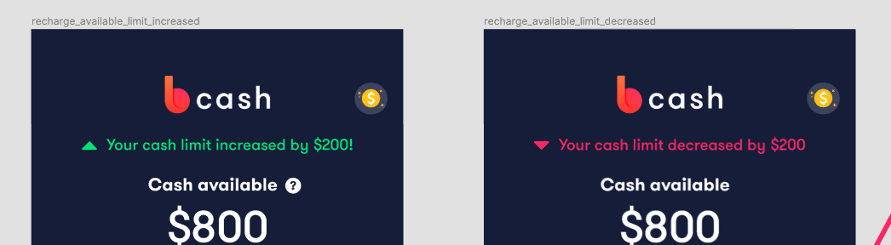
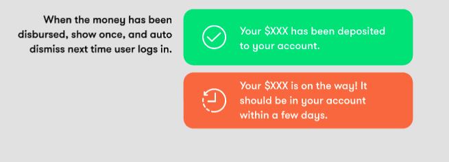
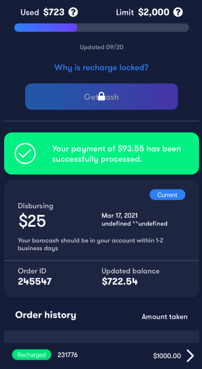
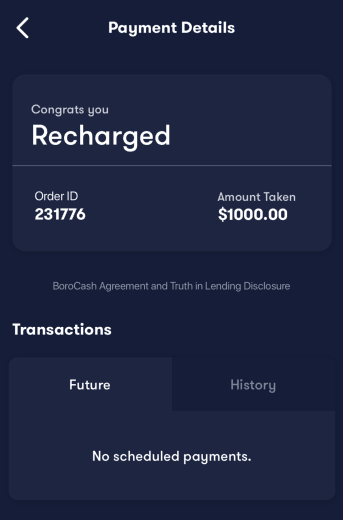

# Friday, April 2, 2021

## Tasks Today

1. Morning Rituals
   1. Daily Planning
   2. Daily Reading Articles
   3. Daily Standup Meeting
2. AllCashOrders Branch
   1. Fix the CashLimitWidget `button` issue. Logic error
   2. Found another issue with `RechargeDeclineScreen`. The Back button nav is wrong
   3. Familiarize with code again. Assumming there's gonna be issues.
3. Bank UI Changes
4. Ask Lakshay can you approve the `future-payment-history` PR. That PR should fix all `future payment history` now
5. 

### Past Order history issues

```
nmarti32@student.scf.edu
12345678
```
Basically it's the same issue as what Isak pointed out. When there's a recharge on top of a old existing cash order, it shows up as a new cash order in the order history. 

Looking at order 228800: The $400 recharge isn't paid off in history but it's paid off in order 233430.

This might be the issue where past cash_orders say `recharged` instead of `Paid off`


In the `fetchAllOrders` mutation call, the paidOffOrders all show the status `recharged` instead of `paidoff`. So this should be an issue on the backend? Not sure it might also be stale data.


The payment history shows it's not fully paid off in that order however, it is paid off in the next order.


#### Paid Off/Recharged Payment Details showing Future payments
```
isaac932696@my.yosemite.edu
12345678
```

Issue: Future payments is showing up even though it's a past order. Why is there still future payments in this tab? 

A: It's pulling the currentCashOrder
Fix: Remove seeing Future Payments for Paid Off/Recharged Orders


I think it's considered one cash order so that's why.


### Example User

gwelly@mail.sfsu.edu <- Has recharge for her order
On the BoroCash Tab what should the logic be like?



so if the person has something like this res from `cashLimit` mutation
```json
"data": {
    "cashLimit": {
        "cashUsed": 0.0,
        "cashLimit": 950.0,
        "isRechargeEnabled": null,
        "decisionUpdatedAt": "2020-12-08T11:10:02-06:00",
        "decisionReasonCodes": [],
        "confirmedAt": "2020-01-12T20:55:51-06:00",
        "errors": []
    }
}
```




### Q: Missing Text for recharged/repay/disbursing

1. The person does not have decision codes. What should we display under the `Why is recharge locked` header?




### Q: CashUsed Not reflecting Recharged Order

1. Another issue is that `recharged` cash orders is if you have an existing `cash order`. In `repay`
   1. ? Can you have `paid off` orders and get a `recharged` order? I think I saw a couple.
   2. BE needs to be changed/modified

**Note: After examination of several accounts with `Recharged`. All of them have `Disbursing` order with `Recharged`. The `CashUsed` reflects correct value.**

---
```
edwamd4@students.fscj.edu
```

User shows that her orders cash Limit looks like this:
```json
"data": {
        "cashLimit": {
            "cashUsed": 0.0,
            "cashLimit": 50.0,
            "isRechargeEnabled": null,
            "decisionUpdatedAt": "2020-12-17T10:44:29-06:00",
            "decisionReasonCodes": [],
            "confirmedAt": "2020-12-17T10:43:48-06:00",
            "errors": []
        }
    }
```
This person took a recharge while she was repaying a cash order. 
1. What does `amount` mean? Is it the total amount of loans left?
2. If that's the case how do you calculate `cashUsed`?

This only happens if the `repay` cash order is not in disbursing. It'll be `repay` when the user is paying off the cash order and `Disburse` once the recharge is accepted?

#### How come this user shows CashUsed 0

Special Case

```
bmedard0707@live.hccc.edu
12345678
```



#### Missing in Design

1. No CashLimit increase/decrease

2. Limit screen w/ overdue

3. No fees or fee description
4. Last two conditions for `LastTransactionBanner` does not have logic implemented


### Minor Tasks

1. Redirect to History Tab for paid off/recharge orders

### Related to Last Two States of LastTransactionBanner


So should the `LastTransactionBanner` be shown as Disbursing?

### How come this users account gives error?

```
garciagarcia.kaitlyn@titans.easternflorida.edu
12345678
```

### Disbursing Order Empty Future Payments

Basically when an user is disbursing, they have empty future payments.

```
fjeanlouis2019@fau.edu
12345678
```



Why is there no future payments? Is it because the order is still disbursing?


