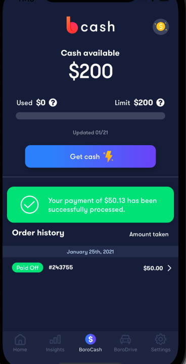

# Week 4 - 2021/05/10 - 05/16

| Mon | Tues | Weds | Thurs | Fri | Sat | Sun |
|-|-|-|-|-|-|-|
|10|11|12|13|14|15|16|


## Daily Breakdowns

### Mon

1. [ ] First Task
2. [ ] Another Task
3. [ ] Third Task

### Tues Apr 27

* [ ] First Task
* [ ] Another Task
* [ ] Third Task

### Weds Apr 28

* [ ] First Task
* [ ] Another Task
* [ ] Third Task

### Thurs Apr 29

* [ ] First Task
* [ ] Another Task
* [ ] Third Task

### Fri Apr 30

* [ ] First Task
* [ ] Another Task
* [ ] Third Task

### Sat May 1

* [ ] Lets continue adding tests to AllCashOrders
* [ ] Figure out how to speed up testing
* [ ] Create more and learn how to test
* [ ] Meeting @2pm with Kpop Group


## Question

### Notification Service

`Routing` refers to how an app's Endpoints responds to client req.
* Listens to request at a specific route(endpt) and HTTP method
  * Executes a corresponding callback method.

[Pretty Good Explanation](https://expressjs.com/en/guide/routing.html)

Also what is `CORS`? I still don't understand fully what it is.

1. What uses the `API` to send out notifications? How do we get these `notifications` or `context` in the first place?

`!!` - Why is this used instead of not having it in the first place? `notificationService L111`

`plaid_item`


## Ask Rey about the $0 Next Payment
Should it be paid_off state or disbursing state?


AwsSQSservice(updatedForcasted, 

orderId,
loanType,

## Testing

### Declined
Note: For new users who are declined, the cashLimit will show
```json
cashLimit": {
            "cashUsed": 0.0,
            "cashLimit": 0.0,
            "isRechargeEnabled": null,
            "decisionUpdatedAt": "2021-04-08T14:11:29-05:00",
            "decisionReasonCodes": [],
            "confirmedAt": "2021-01-10T14:22:39-06:00",
            "errors": []
        }
```
`isRechargeEnabled` will be `null`
#### Declined - Checked
ankita.testdecline2@sjsu.edu
mar2711484@maricopa.edu
wrsedgwi@uno.edu

### Approved
kdixon5@vikings.sjrstate.edu
Fixed issue with dragging screens
To note, the new UI designs haven't been implemented yet.

### Recharge Available
pdevine1@northwell.edu
no active order (Has past orders)
(Oops accidentally recharged)


This should be how it looks like if it doesn't have an active order.

a.m.alomeri@clasnet.sunyocc.edu
Same with this user

### Recharge Unavailable
szeineh@umich.edu
sfarr@zanestate.edu
barbara.holston@snhu.edu
tt5959@umo.edu

Order History doesn't have `load more` button

## Order Statuses

### NoPastDueNotDueToday
elittle7094@mail.kvcc.edu
isaac932696@my.yosemite.edu

### NoPastDueDueToday
acardona2@csub.edu

### PastDueNotDueToday
mguerr15@fau.edu

### PastDueDueToday
jscut001@ucr.edu
dpd - null

## RNTL

`ByText` will join `<Text>` siblings togethers to find matches. Basically querying for strings that visually match.
