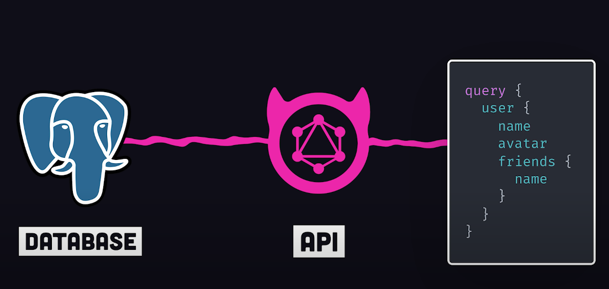

# Week 4 - 2021/04/26 - 05/02

| Mon | Tues | Weds | Thurs | Fri | Sat | Sun |
| --- |
| 

## Daily Breakdowns

### Mon Apr 26

1. [ ] First Task
2. [ ] Another Task
3. [ ] Third Task

## Tues Apr 27

* [ ] First Task
* [ ] Another Task
* [ ] Third Task

## Weds Apr 28

* [ ] First Task
* [ ] Another Task
* [ ] Third Task

## Thurs Apr 29

* [ ] First Task
* [ ] Another Task
* [ ] Third Task

## Fri Apr 30

* [ ] First Task
* [ ] Another Task
* [ ] Third Task

## Sat May 1

* [ ] First Task
* [ ] Another Task
* [ ] Third Task

## Question

### InMemoryCache

[Why Apollo Guide](https://www.apollographql.com/docs/react/why-apollo/)

* Each Graphql result object contains `__type_name` and `id`
* Make sure have `id` so it can automatically update queries that fetch the object with the same `id`

## React 18

React 18 seems to be great change
* [SSR suspense loading](https://github.com/reactwg/react-18/discussions/37)
  * Great Explanations
* [Batching state calls more consistently](https://github.com/reactwg/react-18/discussions/21)

## Reanimated V2

[William Candillion Reanimated 2](https://www.youtube.com/watch?v=e5ALKoP1m-k&t=49s)

Main part is `animation worklets`
- Seperate JS functions that run on a separate thread of main JS thread on the UI thread
- There's two threads
  - JS thread <-JS-Native Bridge-> Native UI thread
- Babel would convert the JS functions to be able to run on the UI thread

### Reanimated 2 Hooks
1. useSharedValue - Available to both the UI/JS thread
2. useDerivedValue - Computed from some worklet execution
   1. Deriving the value from some computation. Oh is that for more complex calculations

## Netflix Full cycle Developers

[HN Thread](https://news.ycombinator.com/item?id=27457150)

## Learning JS/Typescript

[Learning Typescript](https://www.typescriptlang.org/docs/handbook/intro.html)
[Axel Article blogs](https://2ality.com/)
[Deep JS](https://exploringjs.com/deep-js/toc.html)

## Postgres Timestamp

`myfinance_converted_at` is timestamp without time zone

## Hasura GraphQL

[Hasura in 100sec](https://www.youtube.com/watch?v=xiZ61BkMKo8)

Hasura is automated tool that setups a GraphQL with any database you connect with. Basically creates the Backend API for you.

## KoraCard

## Set Budget Notifications

1. remove myfinanceUpdateAt from jeffery.yeung & rey.wu
   1. jeffery - null, ExponentPushToken[qxrzfLHrHhWaTozdfUpMY9]
   2. rey - null, null
   3. fjeanlous - '2021-03-17 17:48:29', null
2. remove getGoals of Jeffery.yeung

