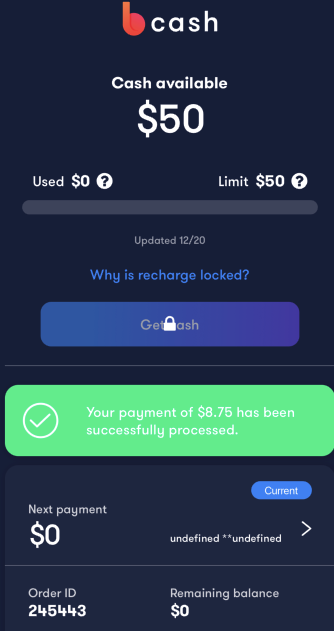

## Issue 1 - Next Payment is 0

[Asana Task](https://app.asana.com/0/1199951603170619/1200268154407507)

This issue is for the below 2 users. Even though they are in `Repay` status, the `CashUsed` and the `nextPayment` is 0.

My assumption is that since the DB is frozen in time, the `Recharge` order wasn't able to transition into `Disbursing` status. Then at `Disbursing` status it would show the correct `CashUsed` or `Remaining Balance`.

```
gwelly@mail.sfsu.edu
12345678

edwamd4@students.fscj.edu
12345678
```
#### gwelly@mail.sfsu.edu

Has a recharge for her order. She should be still in `Repay` but she has next payment as 0.


---
#### edwamd4@students.fscj.edu

This user also has next payment 0.





## Issue 2 - Missing Text for recharged/repay/disbursing

[Asana Link](https://app.asana.com/0/1199951603170619/1200268154407509)

This issue is for users who are in `Disbursing`, `Repay` or such. Their `isRechargeEnabled` status is `null`. Since it is not `1 false` or `0 true` state, the `Why is recharge locked?` is rendered.


If a person does not have decision codes. What should we display under the `Why is recharge locked` header?


## Specific Issue: This user shows CashUsed=0 when remaining balance is not 0

For some reason this user does not show a `Repay` order even though they have some remaining balance. They cancelled their `recharge` amount of $100 but they should still see their `Current Order`.

```
bmedard0707@live.hccc.edu
12345678
```


Res from `FetchAllOrders` mutation
```json
{
    "data": {
        "fetchAllOrders": {
            "paidOffOrders": [
                {
                    "id": 40726,
                    "loanAmount": 50.0,
                    "createdAt": "2020-12-24T00:00:00+00:00",
                    "accountCloseDate": "",
                    "displayStatus": "Recharged",
                    "nextPaymentAmount": 0.0,
                    "nextPaymentDueDate": "2021-04-30T18:34:51+00:00",
                    "amountDue": 0.0,
                    "remainingBalance": 33.67,
                    "collection": null,
                    "dueToday": null,
                    "payScheduleUpdatedAt": null
                }
            ],
            "currentOrders": [],
            "pastDueAndCollectionOrders": [],
            "disburseOrders": [],
            "user": {
                "cashLimit": 200,
                "isRechargeEnabled": null,
                "confirmedAt": "2020-12-24 17:52:16 -0600"
            },
            "isRechargeEnabled": 1,
            "decisionReasonCodes": [],
            "decisionUpdatedAt": "2020-12-24T17:52:46-06:00",
            "cashUsed": 0.0,
            "errors": []
        }
    }
}
```

## Others: Missing in Dev

These features are shown in design but are not in development. These require considerations whether to include in this feature or in a future update.

1. No CashLimit increase/decrease

2. Limit screen w/ overdue

3. No fees shown or fee description modal


4. Last two conditions for `LastTransactionBanner` does not have logic implemented
   1. The reason is that the `getLastTransaction` mutation only retrieves the `Debit` transactions instead of `Credit`.
   2. Do we need to add logic to include these two states?


## Disbursing Order Empty Future Payments
[Asana Link](https://app.asana.com/0/1199951603170619/1200272868731979)

Basically when an user is disbursing, they have empty future payments. How do we deal with this scenario?

```
fjeanlouis2019@fau.edu
12345678
```


Why is there no future payments? Is it because the order is still disbursing?


