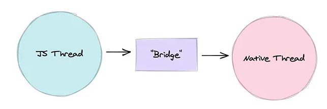
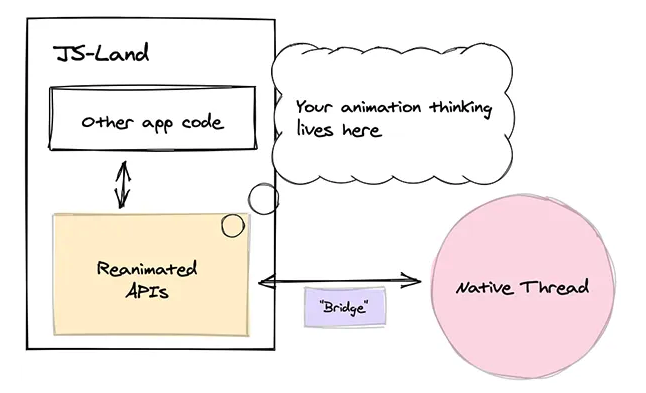

# Reanimated Library

[Great explanation on what reanimated does](https://docs.swmansion.com/react-native-reanimated/docs/)

Library that allows for creating smooth animations & interactions that run on the UI thread.

* In RN, application code is run outside the main thread
* Key Element of RN architecture that prevents frame drops if JS heavy work to do
* Not the case for event-driven interactions
  * User expects immediate effects
  * So if the updates are happening in a separate thread then changes in JS thread will not be reflected in teh same thread
* RN - Updates are delayed by 1 frame because UI/JS communication is async
* UI thread never waits for JS thread to finish processing events

Reanimated comes to offload animation/event handling logic off JS thread and onto the UI thread
* Reanimated worklets - JS code moved to sep JS VM and executed sync on UI thread
* Possible to respond to touch events immediatedly and update UI in the same frame
* Don't have to worry about too much load on the JS thread

## Animations in RN

[Explanation of Animations and Performance](https://formidable.com/blog/2021/reanimated-two/)

Our JS code runs on a JS thread and then communicates through a bridge to a Native Thread.



Performance cost in communicating over the bridge. Most cases, its not an issue. However, aimations may cause performance issues and start dropping below 60fps for animations. Users wonder why your application feels "choppy" or "laggy".

React Native - Animated API
- Library declare animations in JS and push it to the Native UI thread to execute
However, there are issues
- Limitations on what you can do
- Performance constraints
- Ease of implementation

## Reanimated 2

Replaces RN animated API providing Js based animation api easy to use and run on the native thread.



Reanimated will abstract all the details by a **worklet**.

> A **worklet** is a tiny chunk of JS code that can be moved to a separate JS VM and executed synchronously on the UI thread

Worklets are JS fns that get executed on the UI thread allowing us to define native-level animation commands without worrying about cost of the bridge.

Wow the article is really well-written.

**react-native-gesture-handler** allows you to handle gestures natively on the native UI thread instead of on JS thread.


## Reanimated V2

1. Uses declarative style setup for composing your animations

[William Candillion Reanimated 2](https://www.youtube.com/watch?v=e5ALKoP1m-k&t=49s)

Main part is `animation worklets`
- Seperate JS functions that run on a separate thread of main JS thread on the UI thread
- There's two threads
  - JS thread <-JS-Native Bridge-> Native UI thread
- Babel would convert the JS functions to be able to run on the UI thread

### Reanimated 2 Hooks
1. useSharedValue - Available to both the UI/JS thread
2. useDerivedValue - Computed from some worklet execution
   1. Deriving the value from some computation. Oh is that for more complex calculations

## Why not use Animated API from RN

Reanimated is an alternative to Animated API that runs all the animations on UI thread.

1. Syntax
   1. Declarative syntax makes composing animations easier and cleaner
2. Support
   1. Software Mansion, Expo & Shopify supporting this
   2. Open source project
3. Resources
   1. William Candillion YT channel
   2. YT/Tutorials I see more implementations using Reanimated

Need to Read
[React Native Blog on Animated API](https://reactnative.dev/blog/2017/02/14/using-native-driver-for-animated)

Another things is that `Reanimated` also uses `react-native-gesture-handler`. Its from the same company supporting both, `Software Mansion` (https://github.com/software-mansion/react-native-gesture-handler)

Gestures to be recognized and tracked in the UI thread and not in the JS responder system. Touch, gesture tracking is smooth but dependable and deterministic.

`React-navigation` uses both `react-native-reanimated` and `react-native-gesture-handler` for managing smooth animations.

[RN animations intro](https://reactnative.dev/docs/animations)
Reading this, from what I gather, `Animated API` also uses `PanResponder` which is based on JS gesture responder system. So it won't be as smooth as the Native implementation `react-native-gesture-handler` which affects JS thread fps and such

[RN Gesture responder system](https://reactnative.dev/docs/gesture-responder-system)

Limitations:
1. Can't know current value of animation value. While `reanimated` you have sharedvalues which you can use conditionals `if/else` or `?` to determine effect and such.

> Caveats#
> Not everything you can do with Animated is currently supported by the native driver. The main limitation is that you can only animate non-layout properties: things like transform and opacity will work, but Flexbox and position properties will not. When using Animated.event, it will only work with direct events and not bubbling events. This means it does not work with PanResponder but does work with things like ScrollView#onScroll.
> 
> When an animation is running, it can prevent VirtualizedList components from rendering more rows. If you need to run a long or looping animation while the user is scrolling through a list, you can use isInteraction: false in your animation's config to prevent this issue.

This means that you can't do `translateX` or `translateY`. No that's incorrect. `Transform` means 2D or 3D transformations


### Problems and Limitations

1. Built on RN TurboModule arch. Can't support older RN versions (< 0.62)
2. Remote debugging doesnt work. JSI for sync native methods access
   1. Can use Flipper (Native debugger) b/ debugger to JS context running on the UI thread is not supported
3. Objs passed into worklets doesn't have object prototype
   1. Objs aren't enumerable
   2. For ... in ... doesn't work
   3. ... operator doesn't work
   4. Object.assign won't work etc.
4. Can't animate nested `<Text>` components
```javascript
  <Text>
    Hello
    <Text>World</Text>
  </Text>
```

### Installation

#### Android

Must enable `Hermes` and plug `Reanimated` in `MainApplication.java`

#### IOS

Pod install in `ios/` folder

What's autoinstall? [Reanimated IOS installation](https://docs.swmansion.com/react-native-reanimated/docs/installation#ios)